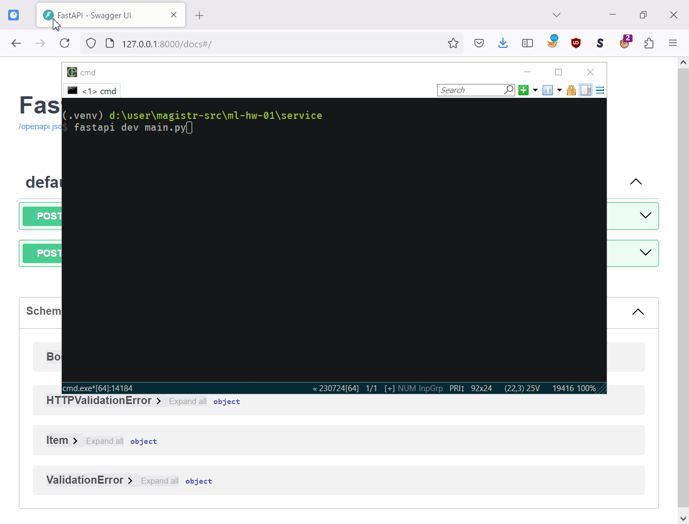

## Домашнее задание №1 (pro)

Студент: Куимов Владислав Игоревич, ИИ24

### Содержимое репозитория

- [Ноутбук](hw-1.ipynb)
- [Дашборд](ydata.html)
- Обученная модель (`model.pickle`)
- Сервис (каталог `service`)

### Что было сделано

- Проведен базовый EDA, удалены дубликаты.
- Почищены и преобразованы значения признаков `mileage`, `engine`, `max_power`, `torque`.
- Заполнены пропуски медианой.
- Добавлены визуализации, построен дашборд и посчитаны корреляции.
- Написана реализация корреляции Кендалла за $N \log N$, реализации $R^2$, $R^2_{adj}$.
- Реализована регрессия с $L_0$-регуляризацией, обучена с разными значениями параметра регуляризации.
- Обучены модели только по числовым признакам, подобраны оптимальные параметры.
- Выполнен OHE для категориальных признаков, обучены модели, подобраны оптимальные параметры.
- Проведен процесс feature engineering: дополнительные признаки (квадрат года, мощность на литр, индикатор пропущенных значений) и логарифмирование.
- Реализованы две бизнес-метрики.
- Создан пайплайн предобработки и прогнозирования для использования в сервисе. Обученный пайплайн сохранен в файл.
- Реализован FastAPI-сервис с двумя методами: построение прогноза по одному значению, либо загрузка файла.

### Результаты

- Модели только на числовых признаках показывают в среднем качество по $R^2 \approx 0.6$.
- Модель с добавлением категориальных признаков и OHE показывает качество примерно 0.73.
- Генерация полиномиальных признаков 2го порядка на основе числовых дает качество около 0.82.
- Финальная модель с категориальными признаками, дополнительными признаками (квадрат года, мощность на литр, индикатор пропущенных значений) и логарифмированием дало качество по $R^2 \approx 0.93$.

### Что дало наибольший буст в качестве

- OHE для категориальных признаков + добавление двух новых признаков + логарифмирование

### Что сделать не вышло и почему

- L0-регуляризация. Не совсем понятно, как реализовывать. По ссылке из ноутбука была реализация через concrete distribution, которая за пределами моего понимания :) Сделал через полный перебор, не уверен, что правильно.
- Долго провозился со сборкой пайплайна предобработки, находить в нем ошибки очень тяжело.
- Также долго реализовывал корреляцию Кендалла, но в итоге получилось.
- Вопрос с выбросами: т.к. неизвестна валюта цены, то сложно сказать, какие цены являются аномальными. По значениям в других признаках тоже ничего сказать не могу, нужна определенная экспертиза в предметной области.

### Скринкаст о работе сервиса

